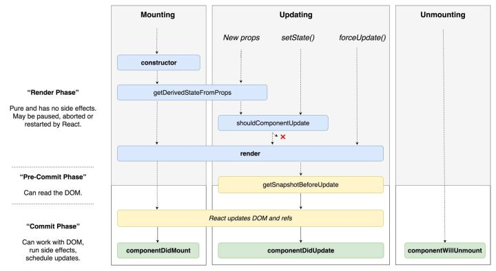

### react新增生命周期用法



**static getDerivedStateFromProps()**
```bash
static getDerivedStateFromProps(nextProps, prevState){
   // 比较是否有变化
    if (nextProps.id !== prevState.prevId) {
     // 返回新的state
      return {
        externalData: null,
        prevId: nextProps.id,
      };
    }
    // 没有需要更新的就返回null
    return null;
}
```

**getSnapshotBeforeUpdate(prevProps, prevState)**
触发时间: update发生的时候，在render之后，在组件dom渲染之前；返回一个值，作为componentDidUpdate的第三个参数；配合componentDidUpdate, 可以覆盖componentWillUpdate的所有用法
```bash
class ScrollingList extends React.Component {
  listRef = React.createRef();

  getSnapshotBeforeUpdate(prevProps, prevState) {
    // Are we adding new items to the list?
    // Capture the current height of the list so we can adjust scroll later.
    if (prevProps.list.length < this.props.list.length) {
      return this.listRef.current.scrollHeight;
    }
    return null;
  }

  componentDidUpdate(prevProps, prevState, snapshot) {
    // If we have a snapshot value, we've just added new items.
    // Adjust scroll so these new items don't push the old ones out of view.
    if (snapshot !== null) {
      this.listRef.current.scrollTop +=
        this.listRef.current.scrollHeight - snapshot;
    }
  }

  render() {
    return (
      <div ref={this.listRef}>{/* ...contents... */}</div>
    );
  }
}
```
